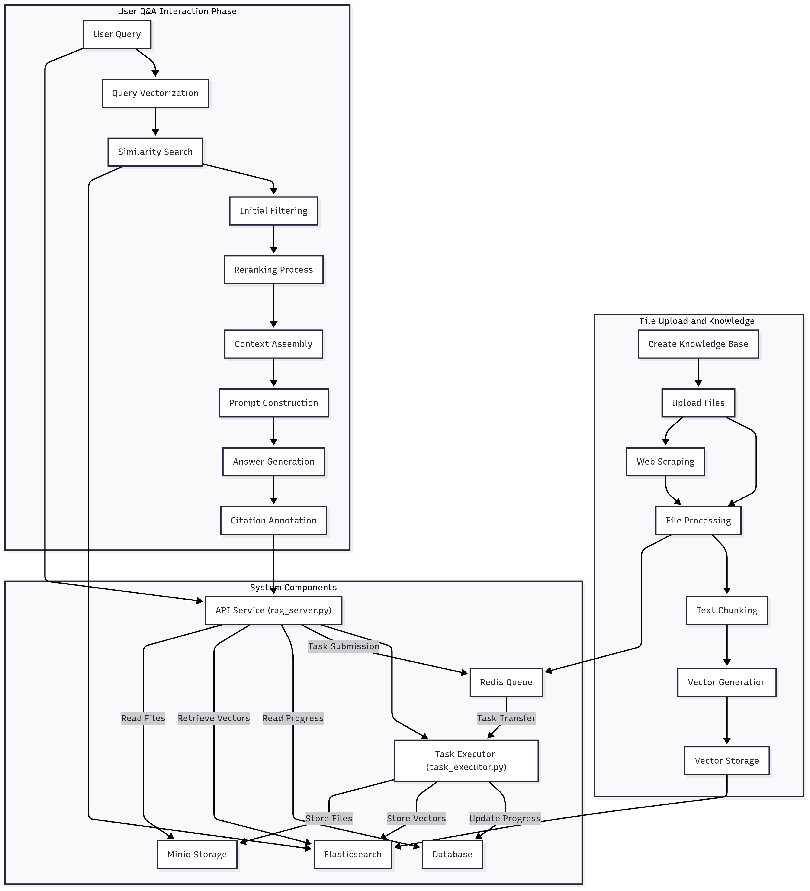
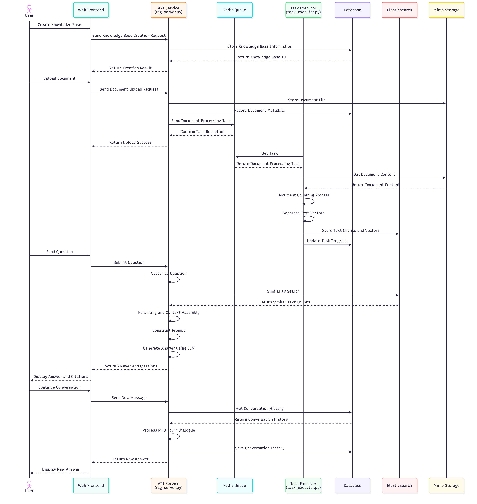
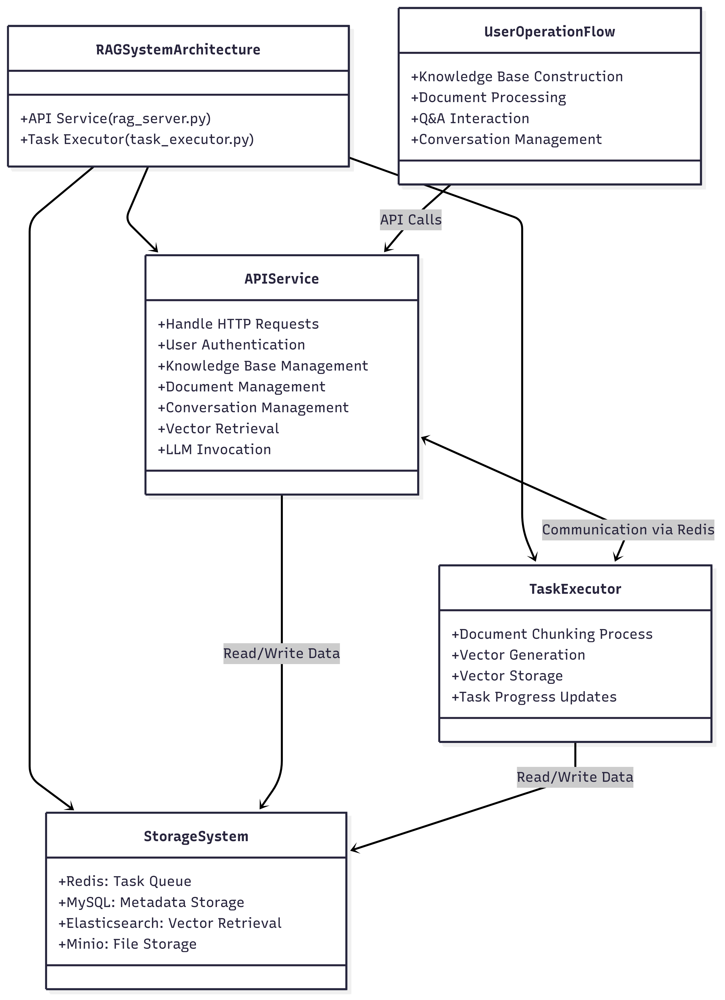

# RAG System Architecture

This document describes the architectural design and workflow of the RAG system.

## System Component Relationship Diagram

## System Interaction Sequence Diagram

## System Class Diagram

## System Design Description

### 1. System Components

The RAG system consists of two main programs:

1. **API Service (rag_server.py)**
   - Provides HTTP interface services
   - Handles user requests
   - Manages knowledge bases, documents, and conversations
   - Performs vector retrieval and LLM invocation

2. **Task Executor (task_executor.py)**
   - Executes document chunking processes
   - Generates text vectors
   - Stores vectors in Elasticsearch
   - Updates task processing progress

### 2. Communication Mechanism

The two programs communicate through the following methods:

- **Redis Queue**: The API service places document processing tasks in the queue, and the task executor retrieves tasks from the queue
- **Shared Database**: Both programs share the same database; the task executor updates progress, and the API service reads the progress

### 3. Advantages of Separation Design

- **Resource Isolation**: Computation-intensive tasks are separated from the API service, ensuring API responsiveness
- **Scalability**: Multiple task executor instances can be deployed to process tasks in parallel
- **Fault Tolerance**: One component crashing does not affect the operation of the other component