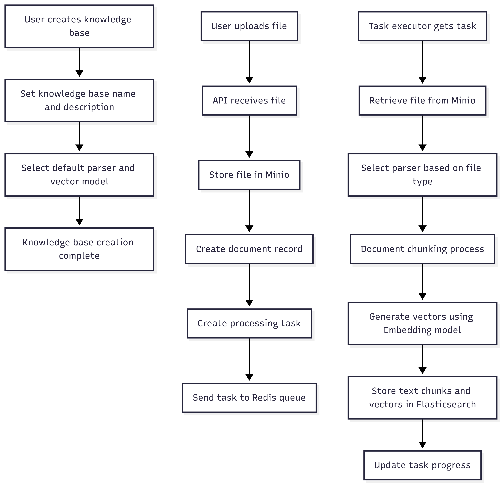
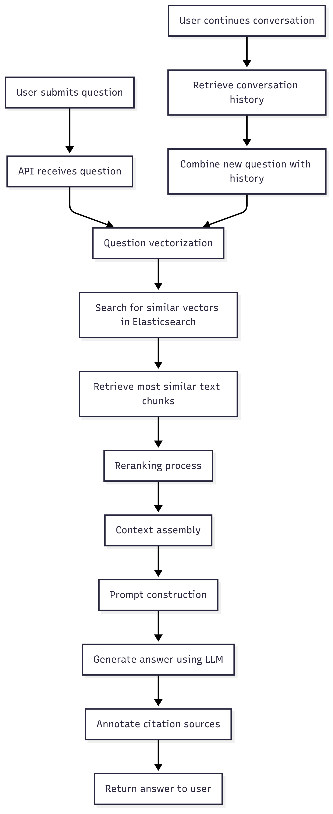
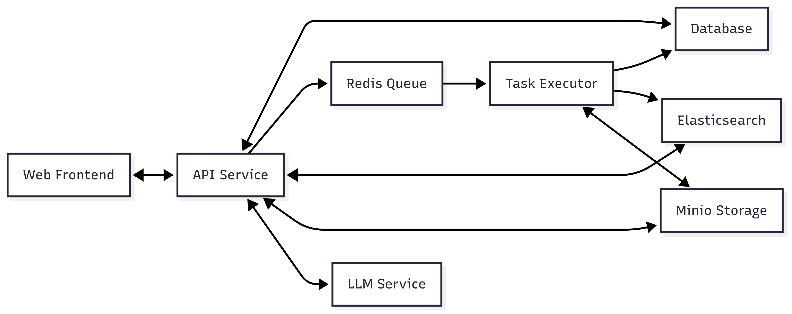

# RAG System Workflow

This document describes the main workflows of the RAG system, including the file upload and knowledge base construction phase and the user Q&A interaction phase.

## 1. File Upload and Knowledge Base Construction Phase

### Process Overview

1. User creates a knowledge base
2. User uploads files
3. System processes documents: chunking, vectorization, storage

### Detailed Process

### Key Code Flow

1. **File Upload**: Handled by the `upload` method in `document_app.py`
2. **Task Creation**: The `queue_tasks` method in `task_service.py` creates tasks and sends them to Redis
3. **Document Processing**: The `build` method in `task_executor.py` handles document chunking
4. **Vector Generation**: The `embedding` method in `task_executor.py` generates vectors
5. **Index Storage**: The `main` method in `task_executor.py` stores vectors in Elasticsearch

## 2. User Q&A Interaction Phase

### Process Overview

1. User submits a question
2. System vectorizes the question and searches for relevant text in the knowledge base
3. System uses LLM to generate an answer and provides citations

### Detailed Process

### Key Code Flow

1. **Question Processing**: Handled by the `completion` or `ask_about` methods in `conversation_app.py`
2. **Vector Retrieval**: Uses the `retrievaler.retrieval` method to retrieve relevant text
3. **Answer Generation**: Uses the `DialogService.chat` or `ask` methods to generate answers
4. **Conversation Management**: Uses `ConversationService` to manage conversation history

## 3. System Component Interaction

### Component Interaction Diagram

### Data Flow

1. **Document Processing Flow**:
   Web Frontend → API Service → Minio → Redis → Task Executor → Elasticsearch

2. **Q&A Flow**:
   Web Frontend → API Service → Elasticsearch → LLM Service → API Service → Web Frontend

## 4. System Configuration and Optimization

### Configurable Parameters

- **Vector Search Parameters**: Similarity threshold, number of results to return
- **Chunking Parameters**: Text chunk size, overlap ratio
- **Model Selection**: Embedding model, LLM model

### Performance Optimization

- **Task Queue**: Using Redis queue for asynchronous processing
- **Distributed Deployment**: Multiple task executor instances can be deployed
- **Resource Isolation**: Computation-intensive tasks are separated from the API service