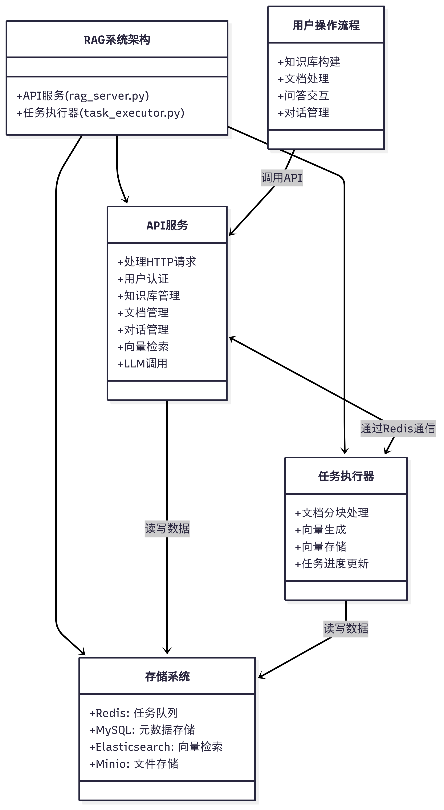

# RAG系统架构

本文档描述了RAG系统的架构设计和工作流程。

## 系统组件关系图

## 系统交互时序图

## 系统类图

## 系统设计说明

### 1. 系统组件

RAG系统由两个主要程序组成：

1. **API服务 (rag_server.py)**
   - 提供HTTP接口服务
   - 处理用户请求
   - 管理知识库、文档和对话
   - 执行向量检索和LLM调用

2. **任务执行器 (task_executor.py)**
   - 执行文档分块处理
   - 生成文本向量
   - 存储向量到Elasticsearch
   - 更新任务处理进度

### 2. 通信机制

两个程序通过以下方式通信：

- **Redis队列**：API服务将文档处理任务放入队列，任务执行器从队列获取任务
- **数据库共享**：两个程序共享同一个数据库，任务执行器更新进度，API服务读取进度

### 3. 分离设计的优势

- **资源隔离**：计算密集型任务与API服务分离，保证API响应性
- **可扩展性**：可以部署多个任务执行器实例来并行处理任务
- **容错性**：一个组件崩溃不影响另一个组件的运行