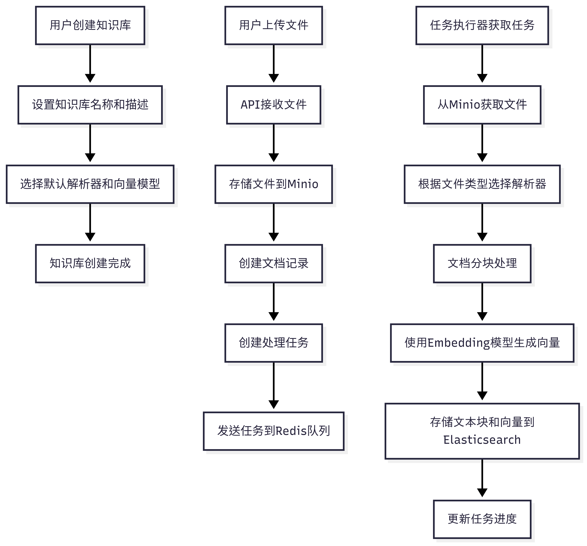
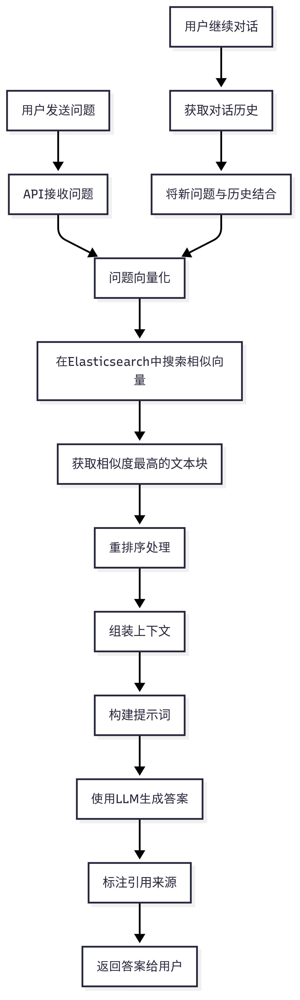
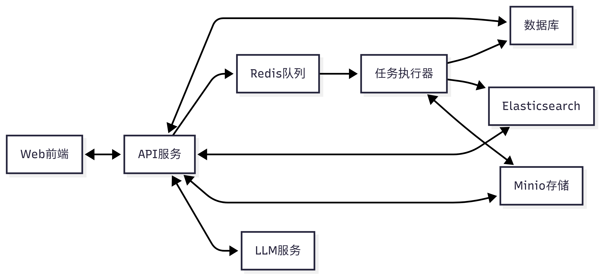

# RAG系统工作流程

本文档描述了RAG系统的主要工作流程，包括文件上传与知识库构建阶段和用户问答交互阶段。

## 1. 文件上传与知识库构建阶段

### 流程概述

1. 用户创建知识库
2. 上传文件
3. 系统处理文档：分块、向量化、存储

### 详细流程

### 关键代码流程

1. **文件上传**：通过`document_app.py`的`upload`方法处理
2. **任务创建**：`task_service.py`的`queue_tasks`方法创建任务并发送到Redis
3. **文档处理**：`task_executor.py`的`build`方法处理文档分块
4. **向量生成**：`task_executor.py`的`embedding`方法生成向量
5. **索引存储**：`task_executor.py`的`main`方法将向量存储到Elasticsearch

## 2. 用户问答交互阶段

### 流程概述

1. 用户发送问题
2. 系统将问题向量化并在知识库中搜索相关文本
3. 使用LLM生成答案并提供引用

### 详细流程

### 关键代码流程

1. **问题处理**：通过`conversation_app.py`的`completion`或`ask_about`方法处理
2. **向量检索**：使用`retrievaler.retrieval`方法检索相关文本
3. **答案生成**：使用`DialogService.chat`或`ask`方法生成答案
4. **对话管理**：使用`ConversationService`管理对话历史

## 3. 系统组件交互

### 组件交互图

### 数据流向

1. **文档处理流程**：
   Web前端 → API服务 → Minio → Redis → 任务执行器 → Elasticsearch

2. **问答流程**：
   Web前端 → API服务 → Elasticsearch → LLM服务 → API服务 → Web前端

## 4. 系统配置与优化

### 可配置参数

- **向量搜索参数**：相似度阈值、返回结果数量
- **分块参数**：文本块大小、重叠比例
- **模型选择**：Embedding模型、LLM模型

### 性能优化

- **任务队列**：使用Redis队列实现异步处理
- **分布式部署**：可部署多个任务执行器实例
- **资源隔离**：计算密集型任务与API服务分离